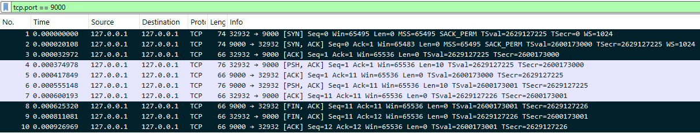

# Modul 1: TCP

## Formål

Bygge en TCP echo-server og -klient med Pythons `socket`-modul, observere three-way handshake og forbindelsestilstande, og forklare forskellen på TCP og UDP. Firewalls og IDS/IPS træffer beslutninger ud fra TCP's forbindelsestilstande, og angreb som SYN-flood udnytter handshaket, så det skal kunne genkendes i en normal capture.

## Udførte opgaver

Miljø: Ubuntu Server (`ubuntuserver`), Python 3.14, loopback `127.0.0.1`. Alle kommandoer køres i gæstesystemet via SSH.

- TCP echo-server og -klient bygget med `socket` ([`server.py`](../src/server.py), [`client.py`](../src/client.py))
- Forbindelsen optaget med `tshark` på `lo`, handshake og afslutning identificeret
- Aktive forbindelser vist med `ss`
- TCP og UDP sammenlignet

### Kommandoer

| Kommando | Formål |
|---|---|
| `hostname`, `ip a`, `python3 --version` | Bekræfter gæstesystem, at `lo` findes, og Python-version |
| `sudo ufw status` | Tjekker at firewallen ikke blokerer loopback |
| `su root` → `apt install -y tshark` | Installerer kommandolinje-Wireshark (serveren har ingen GUI). Kræver root, `admin` har ikke `apt` på sin sudo-liste |
| `sudo usermod -aG wireshark admin` | `admin` må fange pakker uden root (kræver nyt login) |
| `tshark -i lo -f "tcp port 9000" -w /tmp/tcp.pcap` | Optager på loopback, kun TCP port 9000 |
| `tshark -r /tmp/tcp.pcap` | Læser optagelsen i terminalen |
| `scp -P 2222 admin@192.168.189.10:/tmp/tcp.pcap .` | Kopierer optagelsen til Windows til Wireshark-screenshot |
| `sudo ss -tnp \| grep 9000` | Viser TCP-forbindelser (`-t`), numerisk (`-n`), med proces (`-p`) |
| `ss -tn state time-wait` | Viser kun forbindelser i TIME-WAIT |

### Socket-kald

| Kald | Betydning |
|---|---|
| `socket.socket(AF_INET, SOCK_STREAM)` | TCP-socket (`SOCK_DGRAM` ville være UDP) |
| `.bind((HOST, PORT))` | Knytter serveren til `127.0.0.1:9000` |
| `.listen()` | Serveren tager imod forbindelser |
| `.accept()` | Blokerer til en klient forbinder. Returnerer ny socket (`conn`) til netop den klient |
| `.connect((HOST, PORT))` | Klienten opretter forbindelsen. Handshaket sker her |
| `.sendall()` / `.recv(1024)` | Sender / modtager bytes |
| `.encode()` / `.decode()` | Tekst ⇄ bytes |

## Sikkerhedsmæssig begrundelse

Serveren bindes til `127.0.0.1` og ikke `0.0.0.0`, som lytter på alle interfaces. Så kan kun processer i VM'en nå den, og angrebsfladen er mindst mulig.

`tshark` er begrænset af en AppArmor-profil, som kernen håndhæver uanset bruger, også root. Da `tshark` læser rå trafik fra ukendte kilder, kan en ondsindet pakke udnytte en fejl i programmet. Profilen begrænser så skaden til de filer, `tshark` har brug for (least privilege, defense in depth).

I en SYN-flood kommer den sidste ACK aldrig. Serveren holder de halvåbne forbindelser (`SYN-RECV`), indtil køen er fuld og rigtige klienter afvises. Kender man en normal handshake, kan man genkende mønstret: mange SYN uden ACK.

## Dokumentation / bevis

### Capture: handshake og afslutning

Rå output: [`tshark-read.txt`](../evidence/01-tcp/tshark-read.txt)

*Pakke 1-3: three-way handshake. Pakke 8-10: afslutning. Optaget før `sleep` blev tilføjet i koden.*

| # | Retning | Flag | Betydning |
|---|---|---|---|
| 1 | klient (`:32932`) → server (`:9000`) | SYN | Klienten vil forbinde |
| 2 | server → klient | SYN, ACK | Serveren accepterer og vil også forbinde |
| 3 | klient → server | ACK | Handshake færdigt. Begge retninger bekræftet |
| 4 | klient → server | PSH, ACK (`Len=10`) | "Hej server" (10 bytes) afleveres straks |
| 5 | server → klient | ACK (`Ack=11`) | Alle 10 bytes modtaget |
| 6 | server → klient | PSH, ACK (`Len=10`) | Ekkoet sendes tilbage |
| 7 | klient → server | ACK (`Ack=11`) | Ekkoet modtaget |
| 8 | server → klient | FIN, ACK | Serveren lukker sin retning |
| 9 | klient → server | FIN, ACK | Klienten lukker sin retning |
| 10 | server → klient | ACK (`Ack=12`) | Sidste bekræftelse. FIN tæller som ét sekvensnummer |

### Aktive forbindelser (`ss`)

Rå output: [`ss-output.txt`](../evidence/01-tcp/ss-output.txt)

| Tilstand | Betydning |
|---|---|
| `ESTAB` (server `:9000` og klient `:43562`) | Åben forbindelse. Recv-Q og Send-Q er 0 |
| `FIN-WAIT-2` (klient) | Klienten har sendt FIN og fået den bekræftet. Venter på at serveren lukker |
| `CLOSE-WAIT` (server, Recv-Q 1) | Serveren har modtaget klientens FIN, men programmet har ikke lukket endnu |
| `TIME-WAIT` (klient) | Den side, der lukkede først, venter ca. 60 sek., så forsinkede pakker ikke forveksles med en ny forbindelse |

Recv-Q = bytes modtaget men ikke læst af programmet. Send-Q = bytes sendt men ikke bekræftet.

### TCP vs. UDP

| | TCP | UDP |
|---|---|---|
| Forbindelse | Handshake først | Ingen |
| Levering | ACK på hver pakke. Tabte pakker sendes igen | Ingen bekræftelse eller gensendelse |
| Rækkefølge | Sekvensnumre sikrer rækkefølgen | Ingen garanti |
| Overhead | Højere | Lav |
| Bruges til | Websider, SSH, e-mail | Streaming, opkald, spil, DNS |

HTTP bruger TCP, fordi en webside er én samlet fil, hvor hver byte skal komme frem, og i rækkefølge. Ved streaming er en tabt pakke et lille hak, og at vente på den ville forsinke resten mere.

### Fund

| Observation | Undersøgelse | Konklusion |
|---|---|---|
| Klient uden kørende server: `ConnectionRefusedError` | Kørt `client.py` uden server | SYN besvares med RST, når intet lytter. Timeout ville betyde, at en firewall dropper pakken |
| `tshark` kunne ikke læse egne optagelser fra hjemmemappen, heller ikke som root | `ls -l` (rettigheder OK), `cat` læste filen, mappen omdøbt (`æ` → `ae`), `dmesg` ([`apparmor-denied.txt`](../evidence/01-tcp/apparmor-denied.txt)) | AppArmor-profilen `tshark` afviste adgangen. Reglen gælder programmet og ikke brugeren, derfor også root |

## Overvejelser og fravalg

- **Loopback frem for `0.0.0.0`.** Opgaven kræver det, og det er også mindst muligt eksponeret.
- **`tshark` frem for Wireshark GUI.** Serveren har ingen GUI (Linux 101). Optagelsen tages på serveren og åbnes i Wireshark på Windows til screenshot.
- **Optagelse til `/tmp`.** AppArmor-profilen tillader `/tmp`. Profilen er ikke ændret eller slået fra, da den gør det, den er lavet til.
- **Mappenavnet med `æ` var ikke årsagen.** Hypotesen blev testet ved at omdøbe mappen og forkastet, da fejlen blev ved.
- **`sleep(30)` i koden.** Tilføjet, så forbindelsen er åben længe nok til, at `ss` kan nå at vise den.
